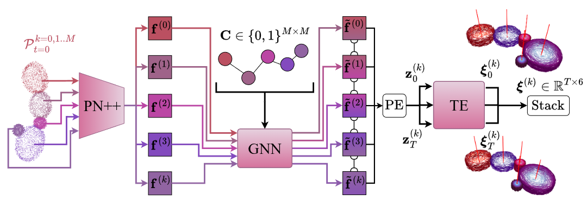
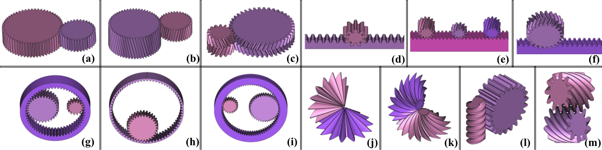

## DYNAMO

This repository contains the official code and dataset for [**DYNAMO: Dependency-Aware Deep Learning Framework for Articulated Assembly Motion Prediction**.](https://dynamo-4t6.pages.dev/)

## About DYNAMO

DYNAMO is a dependency-aware neural network designed to predict how parts of a mechanical assembly move together. Starting from static CAD point clouds, it first extracts shape features for each part, then reasons about which parts are physically coupled, and finally predicts their motion over time. This three-stage process (geometry → coupling → motion) allows DYNAMO to capture both the local shape and the global structure of the assembly, producing realistic trajectories frame by frame.

<!-- Simple Markdown image (uses the raw PNG size) -->


<!-- Alternatively, control size/centering with HTML -->
<!--
<p align="center">
  
</p>
-->

---

## Dataset: MechBench

To train and evaluate our model, we created MechBench, a dataset of 693 synthetic gear assemblies. It spans spur gears, bevels, racks, worms, and planetary systems, covering both simple pairs and complex multi-gear mechanisms. Each assembly comes with 3D meshes, segmentation masks, part-level point clouds, and precise motion annotations, making it a comprehensive testbed for studying coupled motion. Unlike previous datasets, MechBench explicitly encodes dependency-driven motion, where one part’s motion induces another’s, offering a unique challenge for learning-based methods.

<!-- Simple Markdown image -->


<!-- Optional sized/centered version
<p align="center">
  
</p>
-->

### Processed Dataset

For quick training and evaluation, we provide a processed version of the dataset directly in this repository under `data/processed`. Each assembly is a single `.npz` file containing the tensors the loaders expect, so you can get started without downloading raw meshes.

**Each `data/processed/Assembly####.npz` includes:**
- `point_cloud` — `(MAX_PARTS, 2048, 3) float32`  
  Segmented part-level point clouds in a normalized (scaled) coordinate frame.
- `mask` — `(MAX_PARTS,) float32`  
  1.0 for present parts, 0.0 for padded slots.
- `motion_type` — `(MAX_PARTS,) int32`  
  Integer codes for per-part motion type (e.g., rotational).
- `coupling_matrix` — `(MAX_PARTS, MAX_PARTS) int32`  
  Symmetric adjacency of part couplings (1 = coupled, 0 = not coupled).
- `center` — `(MAX_PARTS, 3) float32`  
  Per-part motion centers, expressed in the same scaled frame as `point_cloud`.
- `axis` — `(MAX_PARTS, 3) float32`  
  Per-part motion axes (direction vectors).
- `transform` — `(T, MAX_PARTS, 4, 4) float32`  
  SE(3) transforms per frame and per part in the scaled frame (typically `T = 36`).
- `assembly_id` — scalar/string identifier for the assembly.
- `scaler_center` — `(3,) float32`  
  Center used for normalization.
- `scaler_factor` — `float32`  
  Scale factor used for normalization.

**Splits**
- `data/processed/train_list.txt` — filenames for training.
- `data/processed/test_list.txt` — filenames for testing.

> Note: If you need the original meshes and STEP files, please refer to the full dataset linked on the project page.

---

## Environment Setup

This project was tested on:

- **Python**: 3.10  
- **PyTorch**: 2.1.0 with CUDA 12.1  
- **OS**: Ubuntu 20.04  
- **Conda**: Anaconda (recommended)

We recommend creating a dedicated Conda environment for this project.

---

### Environment Setup

```bash
conda create -n dynamo python=3.10

conda activate dynamo

conda install plotly psutil packaging -y

pip install --no-cache-dir torch==2.1.0+cu121 torchvision torchaudio --extra-index-url https://download.pytorch.org/whl/cu121

pip install torch-scatter==2.1.2 -f https://data.pyg.org/whl/torch-2.1.0+cu121.html

pip install torch-sparse==0.6.18 -f https://data.pyg.org/whl/torch-2.1.0+cu121.html

pip install torch-cluster==1.6.3 -f https://data.pyg.org/whl/torch-2.1.0+cu121.html

pip install torch-geometric==2.6.1

pip install numpy==1.26.4  

pip install git+https://github.com/utiasSTARS/liegroups.git
```

## Training

Please refer to `config/config.py` for epochs, learning rate, batch size, checkpoint paths, and other hyperparameters. To start training:

```bash
PYTHONPATH=. python train/train.py
```

## Testing
After training, set `CHECKPOINT_PATH` in `config/config.py` to the desired checkpoint, then evaluate on the test split:

```bash
PYTHONPATH=. python test/test.py
```
This command prints the following to stdout:

- **Per-assembly mean errors**: rotation (degrees) and translation (scaled units) for each assembly.
- **Overall mean of assembly means**: averages of rotation and translation across all assemblies.
- **Frame range errors**: mean errors over frame ranges **[1–5]**, **[1–15]**, **[1–25]**, **[1–35]** (rotation and translation).
- **Frame window errors**: sliding windows **[1–5]**, **[6–15]**, **[16–25]**, **[26–35]**.
- **Part count errors**: means grouped by part count (2–7 parts).
- **Temporal error curves**: per part-count, frame-wise mean errors over **T** frames (rotation and translation).

## Visualization

Use the interactive Plotly visualizer to inspect predictions (red) and optional ground truth (green):

```bash
PYTHONPATH=. python visualization/visualize_prediction.py
```

- Edit `target_name` inside `visualization/visualize_prediction.py` (or `test/visualize_prediction.py` if you placed it there) to any assembly listed in `data/processed/test_list.txt` (e.g., `Assembly4076.npz`).
- Toggle `PLOT_GT = True/False` in the script to overlay ground truth or show predictions only.
- Ensure `CHECKPOINT_PATH` in `config/config.py` points to your trained checkpoint.
- The viewer opens in a browser; use the slider to scrub frames and the Play/Pause buttons to animate.
